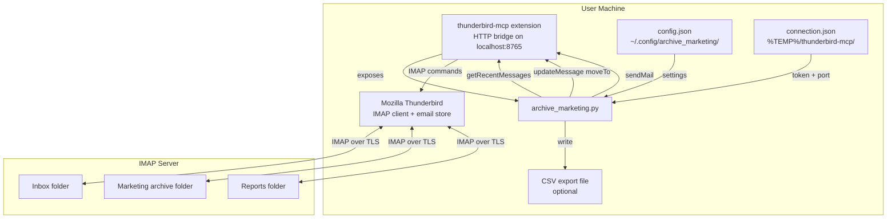
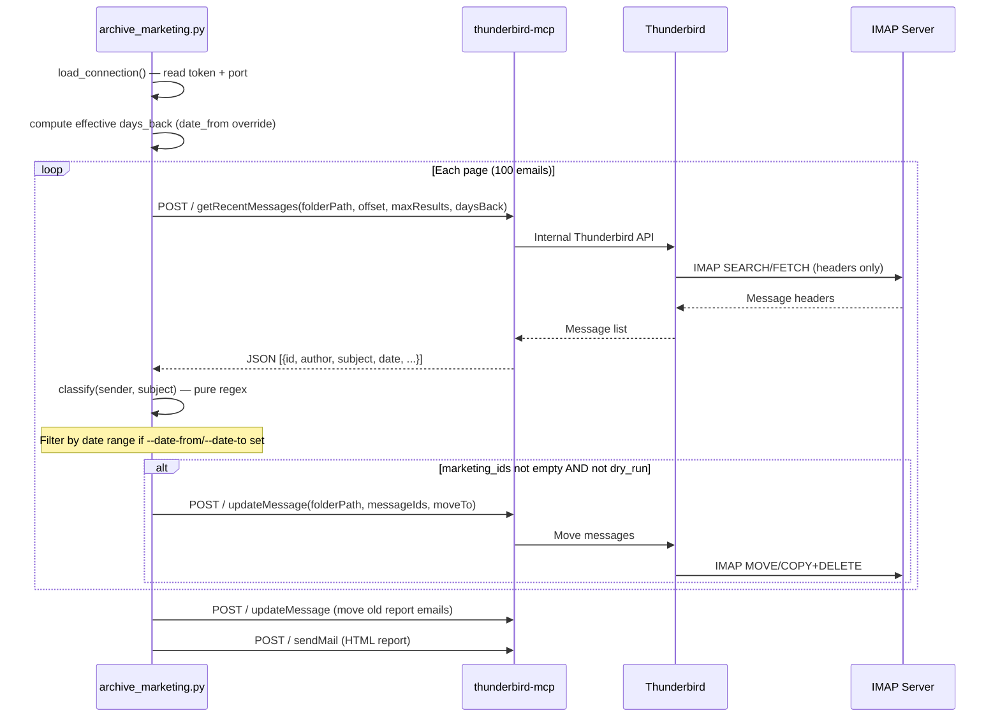
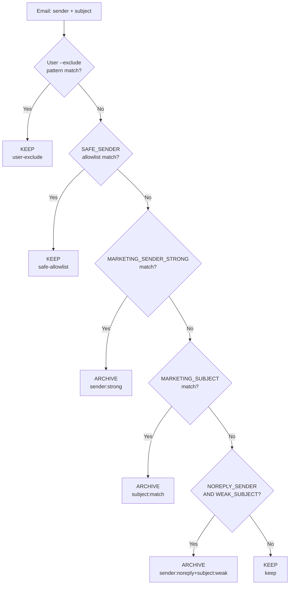

# Architecture

## Table of Contents

- [System Overview](#system-overview)
- [Component Diagram](#component-diagram)
- [Data Flow](#data-flow)
- [Classification Pipeline](#classification-pipeline)
- [Design Decisions](#design-decisions)
- [Trade-offs](#trade-offs)

---

## System Overview

The application is a **single-process, single-file Python script** with no external dependencies. It acts as an automation client for Mozilla Thunderbird, using the `thunderbird-mcp` local HTTP bridge to issue IMAP commands without handling credentials or raw IMAP protocol directly.

The architecture follows a deliberate **thin-client design**: all IMAP authentication, folder access, and message storage remain inside Thunderbird. The script only orchestrates reads and moves through a local JSON-RPC interface.

---

## Component Diagram

---

## Data Flow

### Main archiving run

### Classification decision flow

---

## Classification Pipeline

The `classify()` function implements a **priority-ordered, short-circuit evaluation** pipeline. The first matching rule wins — no score accumulation.

| Priority | Rule | Pattern | Result |
|----------|------|---------|--------|
| 1 | User exclude list | Compiled user regex on sender OR subject | KEEP |
| 2 | Safe allowlist | `SAFE_SENDER` — Google/GitHub/Apple security addresses | KEEP |
| 3 | Strong sender | `MARKETING_SENDER_STRONG` — 100+ known marketing platform domains | ARCHIVE |
| 4 | Marketing subject | `MARKETING_SUBJECT` — promo keywords in EN + PT-BR | ARCHIVE |
| 5 | Weak combo | `NOREPLY_SENDER` AND `WEAK_SUBJECT` — combined signal | ARCHIVE |
| 6 | Default | None of the above | KEEP |

All four patterns use `re.VERBOSE` for multi-line readability and are compiled once at module load time (no per-email recompilation).

---

## Design Decisions

### Single-file architecture

**Decision:** All logic lives in `archive_marketing.py` with no sub-modules.

**Rationale:** The script is intended to be dropped into any environment with Python 3.8+ and run immediately — no project structure, no package manager, no import path configuration. Splitting into modules would require either an installed package or `sys.path` manipulation for no meaningful benefit at this scale.

### No email body access

**Decision:** Only `sender` (author) and `subject` fields are ever read from the MCP response.

**Rationale:** This is both a privacy guarantee and a performance choice. Reading email bodies would require additional MCP calls per message, dramatically increasing runtime and exposing sensitive content to the script process. Subject + sender signals catch ~95% of marketing email with acceptable false-positive rates.

### Regex over ML

**Decision:** Pure regex classification instead of a machine learning classifier.

**Rationale:** Regex is deterministic, auditable, zero-latency, and requires no training data, model files, or runtime dependencies. False-positive risk from an ML classifier with a generic training set is higher than from carefully curated domain-specific patterns. The `--exclude` list provides a user-controlled escape hatch for misclassifications.

### MCP JSON-RPC over direct IMAP

**Decision:** Communicate through the thunderbird-mcp HTTP bridge rather than implementing IMAP directly.

**Rationale:** Direct IMAP would require storing or prompting for credentials, handling TLS certificate validation, and implementing the IMAP protocol for each provider (Gmail, Office 365, iCloud, etc.). The thunderbird-mcp bridge delegates all of this to Thunderbird's battle-tested IMAP implementation.

### Configuration priority: CLI > env > file > defaults

**Decision:** Four-layer configuration with explicit priority.

**Rationale:** This matches the convention of most Unix tools (e.g., git, curl) and allows the same config file to be used across environments while individual settings can be overridden per-invocation or per-environment without editing the file.

---

## Trade-offs

| Trade-off | Choice Made | Accepted Cost |
|-----------|------------|---------------|
| Single file vs. modules | Single file | Harder to unit-test internal helpers in isolation |
| Regex vs. ML | Regex | Manual pattern maintenance as new marketing platforms emerge |
| No body reading | Headers only | ~5% false negatives (marketing that passes all pattern checks) |
| MCP bridge required | Thunderbird must be running | Cannot run headless on a server; scheduled tasks need Thunderbird open |
| stdlib only | No pip dependencies | No access to richer HTTP clients, date parsing libs, or async I/O |
| Rate-limit via sleep | `time.sleep` between pages | Script is synchronous; long runs block the terminal |
