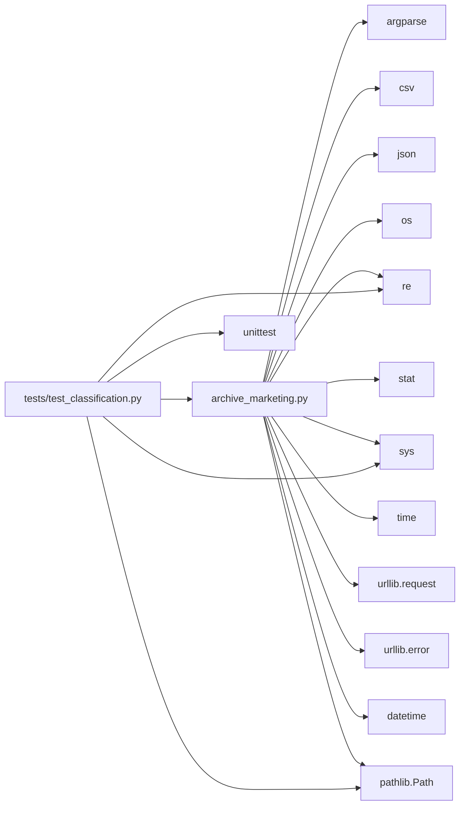

# File Structure

## Table of Contents

- [Directory Tree](#directory-tree)
- [Root-Level Files](#root-level-files)
- [Source Code](#source-code)
- [Tests](#tests)
- [Configuration](#configuration)
- [CI/CD](#cicd)
- [Documentation](#documentation)
- [Runtime Artifacts](#runtime-artifacts)
- [Module Dependency Map](#module-dependency-map)

---

## Directory Tree

```
scripts-archive-marketing/
│
├── archive_marketing.py          # ← Entire application (single file)
├── config.example.json           # Example config — copy to ~/.config/…
├── README.md                     # User-facing project readme
├── LICENSE                       # GNU GPL v3
├── .gitignore
│
├── tests/
│   ├── __init__.py               # Makes tests/ a package
│   └── test_classification.py   # 40 unit tests for classify()
│
├── doc/                          # Technical documentation (this folder)
│   ├── README.md
│   ├── architecture.md
│   ├── file-structure.md
│   ├── setup.md
│   ├── api.md
│   ├── dependencies.md
│   ├── glossary.md
│   ├── contributing.md
│   ├── changelog.md
│   └── modules/
│       ├── classification.md
│       ├── mcp-client.md
│       ├── config.md
│       └── reporting.md
│
├── logs/                         # Runtime log output (gitignored)
│   └── archive-YYYYMMDD-HHMMSS.log
│
└── .github/
    ├── workflows/
    │   └── ci.yml                # GitHub Actions CI pipeline
    └── ISSUE_TEMPLATE/
        ├── bug_report.md
        └── feature_request.md
```

---

## Root-Level Files

### `archive_marketing.py`

The entire application in a single file (~1 300 lines). Internal structure:

| Line range | Section |
|-----------|---------|
| 1–57 | Module docstring, imports, version, UTF-8 reconfiguration |
| 60–87 | `DEFAULTS` dict — all default configuration values |
| 89–101 | `SAFE_SENDER` pattern — always-keep allowlist |
| 103–263 | `MARKETING_SENDER_STRONG` pattern — definite marketing platforms |
| 265–367 | `MARKETING_SUBJECT` pattern — promotional keywords (EN + PT-BR) |
| 369–387 | `NOREPLY_SENDER` + `WEAK_SUBJECT` patterns — weak signal combo |
| 389–425 | Date parsing helpers: `_parse_email_date()`, `_date_arg()` |
| 427–477 | `classify()` — classification engine |
| 479–562 | `load_config()`, `merge_config()` — configuration layering |
| 564–588 | `validate_connection_file()` — connection file permission check |
| 590–647 | `_mcp_call()` — MCP JSON-RPC HTTP client |
| 649–680 | `load_connection()` — reads token + port from connection file |
| 682–715 | `fetch_page()` — paginated inbox fetch via MCP |
| 717–743 | `move_emails()` — bulk IMAP move via MCP |
| 745–763 | `open_csv_writer()` — CSV export setup |
| 765–872 | `ensure_reports_folder()`, `cleanup_prev_reports()` — old report cleanup |
| 874–1030 | `send_report_email()` — HTML report generation and sending |
| 1032–1230 | `run()` — main orchestration loop |
| 1232–1260 | `_print_summary()` — final statistics output |
| 1262–1340 | `build_parser()` — argparse CLI definition |
| 1342–1355 | `__main__` entry point |

### `config.example.json`

Template for user configuration. Copy to `~/.config/archive_marketing/config.json`. All keys are optional — any missing key falls back to the built-in default in `DEFAULTS`.

---

## Tests

### `tests/test_classification.py`

40 unit tests covering all classification tiers:

| Test class | What it covers |
|-----------|---------------|
| `TestSafeAllowlist` | Emails from Google, GitHub, Apple security must never be archived |
| `TestStrongSenderMarketing` | Known marketing platforms (Mailchimp, Shopee, etc.) always archived |
| `TestSubjectMarketing` | Promotional subject keywords trigger archiving |
| `TestWeakComboMarketing` | noreply sender + weak subject word → archived |
| `TestLegitimateEmails` | Non-marketing emails stay in inbox |
| `TestUserExcludeList` | `--exclude` patterns always override all other rules |

Tests import `classify()` directly from `archive_marketing`. No mocking, no network access — pure function tests.

---

## Configuration

### `config.example.json`

```json
{
  "inbox":          "imap://you%40gmail.com@imap.gmail.com/INBOX",
  "archive_folder": "imap://you%40gmail.com@imap.gmail.com/Marketing",
  "page_size":      100,
  "fetch_delay":    2.0,
  "exclude":        ["boss@mycompany.com"],
  "send_report":    false,
  "reports_folder": ""
}
```

All accepted keys map 1-to-1 to entries in the `DEFAULTS` dict in `archive_marketing.py`.

---

## CI/CD

### `.github/workflows/ci.yml`

Two jobs run on every push and pull request to `master`:

**`test` job** — matrix: Python 3.8, 3.9, 3.10, 3.11, 3.12 × Ubuntu, Windows, macOS (15 combinations):
1. `python -m unittest tests.test_classification -v`
2. `python -c "import archive_marketing; print('OK')"` — syntax check

**`lint` job** — Python 3.12 on Ubuntu:
1. `pip install ruff`
2. `ruff check archive_marketing.py tests/`

---

## Documentation

All files under `doc/` are self-contained Markdown. They cross-reference each other with relative links. Generated from codebase analysis — update when `archive_marketing.py` changes.

---

## Runtime Artifacts

### `logs/`

Log files written by external schedulers or wrapper scripts. Not written by `archive_marketing.py` itself (the script prints to stdout). Gitignored.

### `%TEMP%\thunderbird-mcp\connection.json` (Windows)
### `/tmp/thunderbird-mcp/connection.json` (macOS/Linux)

Written by the thunderbird-mcp extension. Contains the bearer token and port for the current Thunderbird session. Regenerated each time Thunderbird starts. **Never committed** — listed in `.gitignore`.

---

## Module Dependency Map

`archive_marketing.py` is self-contained. All imports are Python stdlib:


